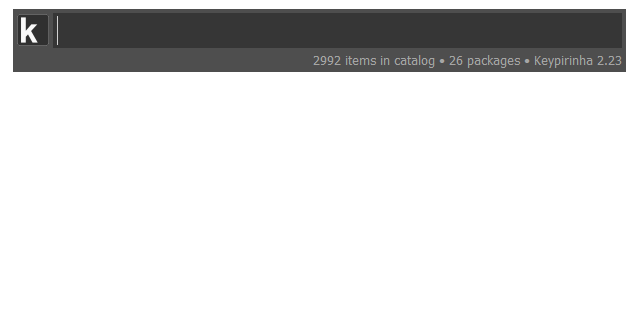

# Keypirinha Plugin: Codic

ネーミングサービス「Codic」を「Keypirinha」から使えるようにするプラグイン

This is a plugin of [Keypirinha](http://keypirinha.com) for using [Codic](https://codic.jp/).

## Install

### Managed

Use [PackageControl](https://github.com/ueffel/Keypirinha-PackageControl), a package manager that easy to install third-party packages.

### Manually

1. Download the latest `Codic.keypirinha-package` file from [Release](https://github.com/shuGH/keypirinha-codic/releases).
2. Move it to the `InstalledPackage` folder located at:
    * `Keypirinha\portable\Profile\InstalledPackages` in **Portable mode**
    * `%APPDATA%\Keypirinha\InstalledPackages` in **Installed mode**

## Usage

1. Codicのページから **`アクセストークン`** を取得してください
    * cf. https://codic.jp/docs/api#authorization
2. Codicプラグインの設定を開き、アクセストークンを記入してください
3. Keypirinha を起動し、`Codic:` と打ち込んでください
    * デフォルトのラベルは変更可能です
    * ケース等の設定毎に個別の名前を定義可能です

　

1. Get **`Acccess Token`** to use Codic api.
    * cf. https://codic.jp/docs/api#authorization
2. Open codic plugin configuration, and write your Acccess Token to `codic.ini`.
3. Launch keypirinha and type `Codic:`.
    * Default label name is changeable, and you can defaine other labels by each casing.

## Configure

You can set Project ID, Casing, Accronim Style and more.
See `codic.ini` file for details.

## Change Log

### v1.1

* Added item to choose from candidates.

### v1.0

* Added simple feature to call translate API.

## License

This package is distributed under the terms of the [MIT](https://github.com/shuGH/keypirinha-codic/blob/master/LICENSE) license.

##  Autor

[Shuzo.Iwasaki](https://github.com/shuGH)

( • ̀ω•́ )و enjoy!
